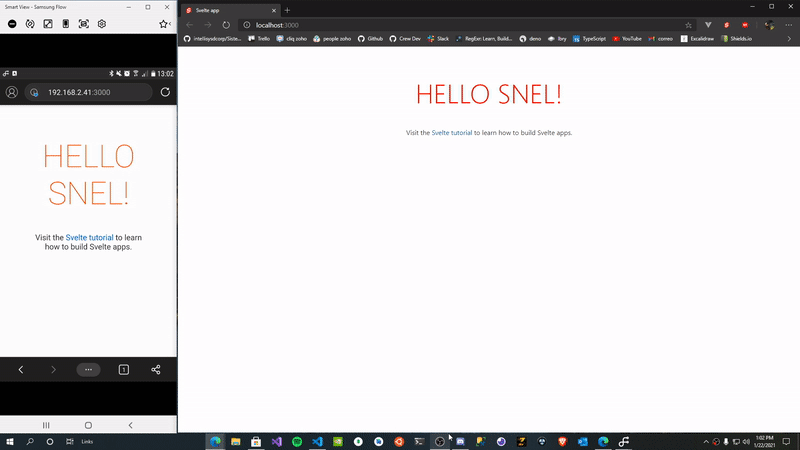

<h1 align="center">Snel 🦕</h1>

<p align="center">
  
  <p align="center">A Cybernetical compiler for svelte applications in deno (Snel = fast in Nederlands) </p>
</p>

<p align="center">
   <a href="https://github.com/crewdevio/Snel/issues">
     
   </a>
   <a href="https://github.com/crewdevio/Snel/network">
     
   </a>
   <a href="https://github.com/crewdevio/Snel/stargazers">
     
   </a>
   <a href="https://github.com/crewdevio/Snel/blob/master/LICENSE">
     
   </a>
   <a href="https://deno.land">
     
   </a>
</p>

#

## What is Snel?

It is a `tool/framework` to compile .svelte component to javascript files to create web application using deno and svelte

## Main features

- simple setup
- quick compilation
- hot reloading
- [import maps](https://github.com/WICG/import-maps) support
- support for scss and less out of the box
- support for typescript and sass out of the box (soon)
- SSR (soon)

## What do I need to start using Snel?

the only thing you need is to run the installation command.

```console
deno run --allow-run https://deno.land/x/snel/install.ts
```

> wait wait! Why should I run a script instead of using deno install to install Snel?

Snel uses several tools to create a better development experience, some of these tools are:

- [**trex**](https://github.com/crewdevio/Trex) to handle scripts and compilation in watch mode.
- [**bundler**](https://deno.land/x/bundler) minify and package all files for production

the [install.ts](https://github.com/crewdevio/Snel/blob/main/install.ts) file is responsible for installing all these tools so that you only worry about creating your application.

## how to create a project with Snel?

after running the installation script you just have to run the create command:

```console
snel create [project name]
```

then you just have to enter the created project and start the development server

```console
cd ./[project name]

trex run start
```

this starts your application on a development server in the port you entered in the configuration

## Using svelte core libraries

to use svelte core libraries such as transition, store, motion etc. must be called using the following syntax:

```javascript
import { cubicOut } from "svelte/easing";
import { tweened } from "svelte/motion";
import { onMount } from "svelte";
```

`svelte` tells the compiler that svelte core resources are being accessed.

## Using svlc/svelte compiler

Snel uses the svelte compiler to transform the components to javacript, if you just want to use the compiler separately, we provide a compiler wrapper within a simple cli that you can install using deno install or transform it to an executable using deno compile.

`install compiler`

```
deno install -A --unstable https://deno.land/x/snel/compiler/svlc.ts
```

`transform to executable`

```
deno compile -A --unstable https://deno.land/x/snel/compiler/svlc.ts
```

If you are interested in using the low-level compiler tools, you only have to access the [compiler.ts](https://github.com/crewdevio/Snel/blob/main/compiler/compiler.ts) file, which is a bridge between the svelte compiler (already transformed to javascript see [core.js](https://github.com/crewdevio/Snel/blob/main/compiler/core.js)) which provides typing and useful interfaces when using the compiler core.

## Using import maps

You can use import maps to reference the dependencies you use, to use import maps from bes have an `import_map.json` file with the following structure:

```json
{
  "imports": {
    "[package name]": "[package url]"
  }
}
```

In order for the compiler to know that you are using import maps, you need to import the dependencies as follows:

```javascript
import moment from "map:moment";
import axios from "map:axios";
```

> **note** this syntax is inspired by how [node js 15](https://nodejs.org/api/esm.html#esm_node_imports) built in modules are imported

### Manage import maps dependencies via [trex](https://github.com/crewdevio/Trex)

if you don't have an import map.json file you can create it using the `trex install` command, trex is mainly focused on handling dependencies for `deno` but this doesn't prevent you from being able to use it to handle your dependencies for `snel/svelte`. to install any dependency you just have to use the [custom command](https://github.com/crewdevio/Trex#adding-custom-packages) from trex:

```console
trex --custom axios=https://cdn.skypack.dev/axios
```

this will install axios and it will make it accessible in the import map file:

```json
{
  "imports": {
    "axios": "https://cdn.skypack.dev/axios"
  }
}
```

> **note**: You should know that your dependencies must be compatible with [es modules](https://developer.mozilla.org/en-US/docs/Web/JavaScript/Reference/Statements/import) and with the browser, if you refer to some import maps package and it is not found by the compiler, it will not be transformed, so an error will appear in your browser.

we recommend these sites for you to install your dependencies

- [skypack.dev](https://www.skypack.dev/)
- [esm.sh](https://esm.sh/)
- [jsdelivr.com](https://www.jsdelivr.com/)

## Hot Reloading

Snel provides hot reload capability, it compiles and updates the application when changes are applied to it

`example`


